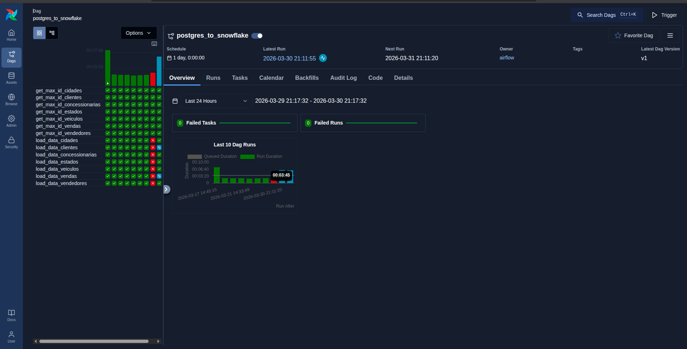
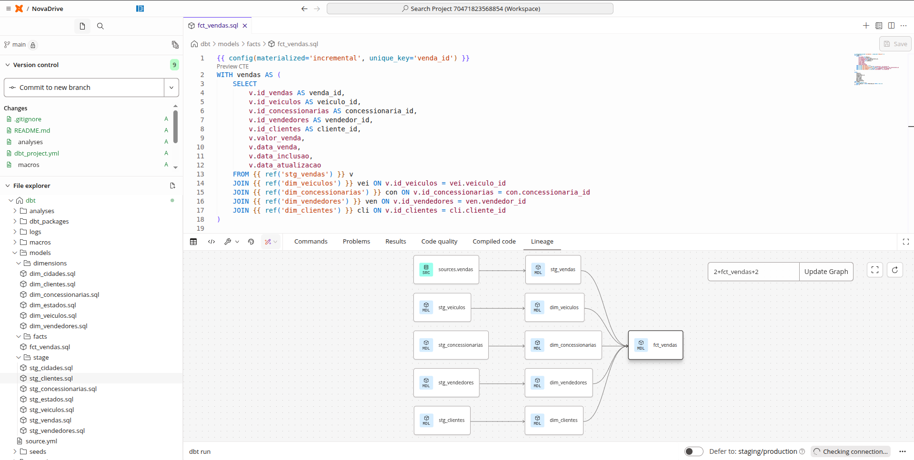
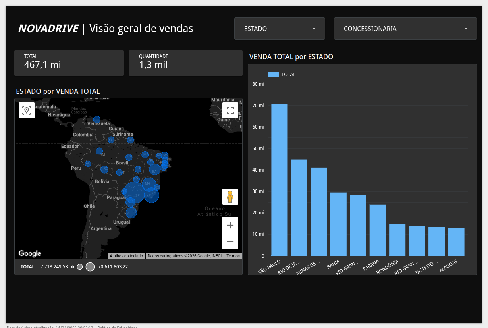

# 🏎️ NovaDrive Motors: End-to-End Modern Data Pipeline

Este projeto simula uma operação real de engenharia de dados para a **NovaDrive Motors**, uma montadora de veículos fictícia. O objetivo central é a migração e transformação de dados transacionais de um sistema de vendas (PostgreSQL) para um ambiente analítico de alta performance (Snowflake), garantindo escalabilidade, governança e automação.

---

## 🏗️ Arquitetura do Ecossistema
O pipeline foi construído utilizando a **Data Stack Morderna**, focando em uma estratégia de **ELT** (Extract, Load, Transform) para otimizar o processamento em nuvem onde implementei uma modelagem Star Schema com tabelas Fato e Dimensão.
Na fato utilizei o Grão Grosso por conta das atualizações serem diárias com uma configuração incremental facilitando a alimentação da fato com somente os dados novos. 

* **Fonte de Dados:** PostgreSQL (Banco transacional operando em tempo real).
* **Orquestração:** Apache Airflow rodando em containers Docker dentro de uma instância **AWS EC2 (m7i-flex.large)**.
* **Data Warehouse:** Snowflake (Camadas estruturadas de *Stage* e *Analytics*).
* **Transformação:** dbt (Data Build Tool) para modelagem dimensional, governança e qualidade.




---

## 🛠️ Destaques Técnicos

### 1. Ingestão Incremental com Airflow
Para evitar o desperdício de recursos computacionais, desenvolvi uma DAG que implementa a lógica de **Carga Incremental**.
* A tarefa identifica o `MAX(ID)` presente no Snowflake para cada tabela.
* O script extrai do Postgres apenas os registros novos (`WHERE ID > MAX_ID`).
* **Resultado:** Redução drástica no volume de dados trafegados e no tempo de processamento conforme o banco cresce.

### 2. Infraestrutura as Code (Docker & AWS)
Todo o ambiente de orquestração foi conteinerizado para garantir a idempotência e facilitar o deploy.
* Configuração do Airflow via **Docker Compose**.
* Deploy em ambiente **Ubuntu Server** na AWS.
* Configuração de **Security Groups** e **Inbound Rules** para acesso seguro à interface Web (Porta 8080).

### 3. Analytics Engineering com dbt
Apliquei as melhores práticas de modelagem dentro do Snowflake para transformar dados brutos em ativos de negócio:
* **Staging Layer:** Limpeza, renomeação técnica de colunas e normalização de tipos de dados.
* **Analytics Layer:** Modelagem dimensional com criação de tabelas **Fato (Vendas)**, **Dimensões (Veículos, Clientes, Concessionárias)** e **Analysis (Vendas para análise)**.
* **Data Quality:** Implementação de testes automatizados e documentação de linhagem (*lineage*).


---

## 📂 Estrutura do Repositório

```bash
├── airflow/           # Configurações do Docker e infraestrutura AWS EC2
│   └── dags/          # DAG Python de carga incremental (Postgres -> Snowflake)
├── dbt/               # Projeto dbt (Models, Sources e Configurações)
│   ├── models/        # Camadas de Staging e Marts (Fatos e Dimensões)
│   └── dbt_project.yml
├── sql/               # DDLs originais de criação das tabelas no Snowflake
└── .gitignore         # Proteção de credenciais e arquivos sensíveis
```

---

## 🚀 Como Executar
**Pré-requisitos:** Docker e Docker Compose instalados.

### 1. Configurar Orquestração (Airflow)

```bash
docker compose up airflow-init
docker compose up -d
```

### 2. Executar Transformações (dbt)

```bash
cd dbt
dbt deps
dbt run
dbt test
```

## 📊 Data Visualization & Business Insights

A etapa final do projeto consistiu na criação de um dashboard executivo no **Looker Studio**, consumindo os dados modelados em Star Schema na camada de Marts do Snowflake. O objetivo é fornecer à diretoria da NovaDrive Motors uma visão clara da performance de vendas.

### KPIs Monitorados:
* **Faturamento Total:** Visão consolidada da receita gerada.
* **Volume de Vendas por Concessionária:** Identificação das unidades com melhor performance.


> **Diferencial Técnico:** O dashboard utiliza a modelagem feita via dbt, garantindo que as métricas sejam consistentes e que o processamento pesado (Joins e agregações) ocorra no Snowflake, resultando em uma interface de BI extremamente rápida.


---

## 🎓 Créditos e Reconhecimento

Este projeto foi desenvolvido como parte do **Bootcamp de Engenharia de Dados**, sob a instrução do professor [Fernando Amaral (Data Engineer Lead, ML & GenAI Practitioner)](https://www.linkedin.com/in/fernando-amaral/?originalSubdomain=br).

O treinamento forneceu o cenário de negócio prático e as diretrizes arquiteturais para a implementação deste pipeline.

---

## 👨‍💻 Autor

**Danilo Natan**
_Software Developer transicionando para Engenharia de Dados._
* [LinkedIn](https://linkedin.com/in/danilo-natan-74a760243)
* [GitHub](https://github.com/daniloNatan)
